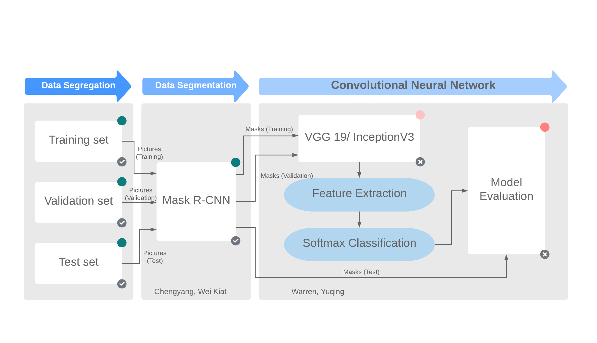

# Pose Detection
Deep learning model for the classification of poses in images using Mask RCNN and VGG19.
This model classifies 15 different [poses](https://github.com/CannyAss/Pose-Detector/tree/master/train).
Model can be easily adapted to classify new poses (maximum of 2 persons) provided that the dataset is given.
Outline of model architecture is [here](https://docs.google.com/presentation/d/1bKgrev_AaPP7kcs3eIM6DbNdq2MhLEgCRjIej_ouhaE/edit#slide=id.g5bd69779d2_0_64).
Archive of submission for Today I Learned Ai Camp 2019, with a final validation score of 0.70989.


## Model Architecture


## Getting Started


### Prerequisites


Clone this github respository
```
!git clone github.com/CannyAss/Pose-Detector
```


### Installing


A step by step series of examples that tell you how to get a development env running


Say what the step will be


```
Give the example
```


And repeat


```
until finished
```


End with an example of getting some data out of the system or using it for a little demo


## Running the tests


Explain how to run the automated tests for this system


### Break down into end to end tests


Explain what these tests test and why


```
Give an example
```


### And coding style tests


Explain what these tests test and why


```
Give an example
```


## Built With

* [Mask_RCNN](https://github.com/matterport/Mask_RCNN) - The library used for instance segmentation
* [Keras](https://keras.io/applications/) - The deep learning module used for classification


## Authors


* **Chengyang** - *Generation of good masks from dataset*
* **Warren** - *Selection and curation of deep learning model*
* **Wei Kiat** - *A little bit of both*
* **Yuqing** - *Visualisation of pipeline and presentation*


## Acknowledgments

* Defence Science and Technology Agency for the dataset and competition experience